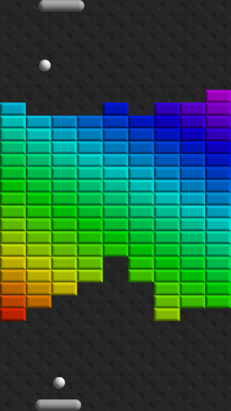

# Breakthrough



A web-based game in which you compete against the computer to bounce balls through a wall of bricks between your
opposing paddles, eventually tunneling through and allowing each player to score against their opponent.

Written in C++, compiles to WebAssembly (with WebGL and WebAudio) using Emscripten.

## Playing
You can play the game online [here](https://andrzejkapolka.com/breakthrough).

## Building
Requires [Emscripten](https://emscripten.org/docs/getting_started/downloads.html) and
[CMake](https://cmake.org/install/).

From the cloned repository directory:
```
emcmake cmake -B build
cd build
make
```
This builds into the top-level `dist` directory, after which you can use (for example, from the `build` directory)
`emrun ../dist/index.html` to launch a browser tab running the game.

## Future Enhancements
Apart from general visual and audio improvements, the game would benefit from a scoring system.